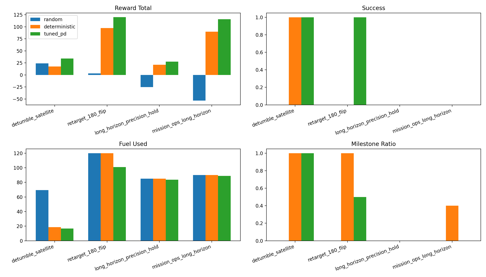
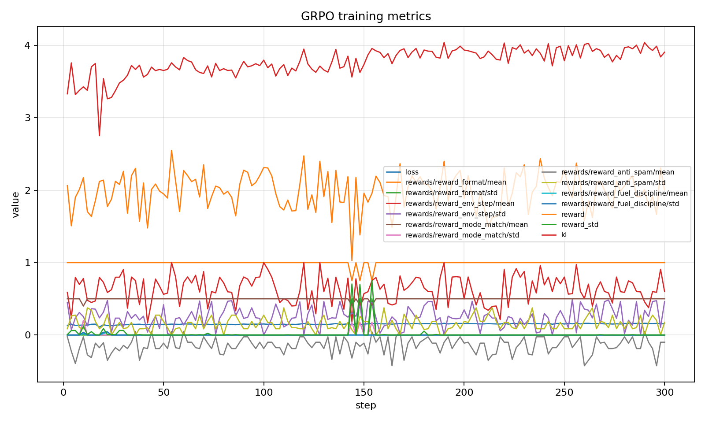
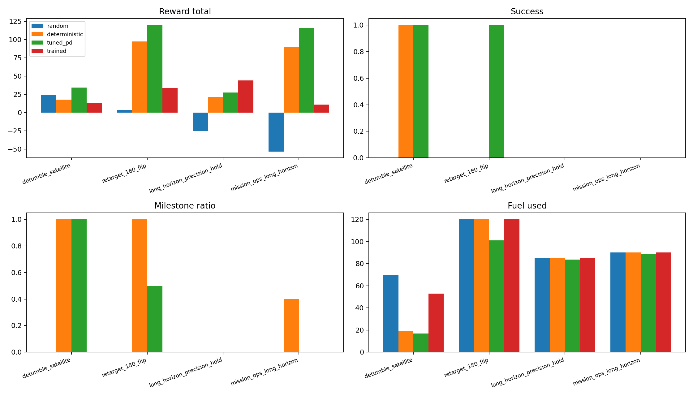

# OrbitalThrusterEnv

OpenEnv benchmark for **Theme #2: (Super) Long-Horizon Planning & Instruction Following**. The agent must track mission directives over a long episode, preserve fuel for delayed objectives, recover from anomalies, and finish in precision hold.

**Submission links**
- Hugging Face Space: https://huggingface.co/spaces/pixxel-phantom/orbital-thruster-env
<<<<<<< HEAD
- Trained adapter (GRPO LoRA, 1.5B): https://huggingface.co/pixxel-phantom/orbital-thruster-grpo-fast
- Trained adapter (GRPO LoRA, 4B): https://huggingface.co/pixxel-phantom/orbital-thruster-grpo
- Mini-blog / write-up: https://huggingface.co/spaces/pixxel-phantom/orbital-thruster-env/blob/main/BLOG.md

=======
- Trained adapter (GRPO LoRA): https://huggingface.co/pixxel-phantom/orbital-thruster-grpo-fast
- Training notebook: [`training/train_orbital_grpo.ipynb`](training/train_orbital_grpo.ipynb)
>>>>>>> c5d4c7cc854e27edbca167d30c9014299ee5039b

**Pitch**: early waste breaks later phases. A controller that looks good on short-horizon pointing can still fail the flagship mission because it burns fuel before the retarget, mishandles the anomaly, or reaches the final hold phase with no reserve left.

## Problem

Modern mission-operations control is not one action repeated forever. It is a chain of directives:

1. Detumble after deployment.
2. Respect a quiet coast window.
3. Repoint to a new relay geometry.
4. Recover from an injected gyro-bias anomaly.
5. Finish with stable precision hold.

This benchmark turns that story into a verifier-backed environment with explicit milestones, delayed checkpoints, and anti-shortcut rewards.

## Environment

The environment keeps the existing orbital control core:

- 13 discrete thruster actions plus `idle`
- deterministic seeded disturbances
- limited RCS fuel
- dense physical reward from pointing, stability, fuel, and overshoot

On top of that, the mission-ops pivot adds:

- `mission_brief`
- `active_directive`
- `pending_directives_count`
- `milestones_completed`
- `anomaly_flags`
- `fuel_reserve_target`
- `phase_deadline_step`
- `reward_breakdown`
- `episode_metrics`

Each action now also includes a required `control_mode`:

- `detumble`
- `slew`
- `brake`
- `trim`
- `hold`
- `recover`
- `safe_hold`

## Tasks

### Curriculum Tasks

- `detumble_satellite` (`easy`): stabilize a newly deployed spacecraft and finish with ample reserve.
- `retarget_180_flip` (`medium`): survive a delayed maneuver window, execute the large flip, and settle cleanly.
- `long_horizon_precision_hold` (`hard`): preserve a fine-pointing envelope under long disturbance exposure.

### Flagship Theme #2 Task

- `mission_ops_long_horizon` (`hard`): a single episode that chains detumble, coast discipline, retargeting, anomaly recovery, and final precision hold.

This flagship task is the main demo task for the hackathon.

## Reward Design

The environment logs rubric-style reward columns instead of a single opaque scalar:

| Column | Signal |
|---|---|
| `physical_tracking_reward` | Pointing accuracy + hold streak bonus − stability − overshoot penalties |
| `fuel_discipline_reward` | Per-step fuel cost penalty + reserve-gap penalty |
| `milestone_completion_reward` | +0.35 on verified directive completion |
| `control_mode_reward` | +0.12 if declared mode matches recommended; −0.08 otherwise |
| `anomaly_recovery_reward` | Bonus for error/rate improvement under active anomaly |
| `anti_stall_penalty` | Penalty for consecutive steps without meaningful progress |

These are surfaced per step in `reward_breakdown` and aggregated in `state.reward_columns`. That makes it easy to show judges not only that reward improved, but **which behaviors improved**.

## Baselines

Three baselines are supported end-to-end:

- seeded random controller
- deterministic PD controller
- tuned PD controller

The current intended story is:

- deterministic clears `easy`
- tuned PD clears `medium`
- both heuristics fail the flagship mission

Fixed-seed baseline results:

| Policy | Easy (detumble) | Medium (retarget) | Hard (hold) | Flagship | Fuel Used (flagship) |
|---|---|---|---|---|---|
| Random | 23.9 / fail | 3.2 / fail | −25.3 / fail | −53.5 / fail | 90.0 |
| Deterministic PD | 17.6 / **pass** | 97.4 / fail | 21.1 / fail | 89.8 / fail | 90.0 |
| Tuned PD | 34.2 / **pass** | 120.1 / **pass** | 27.5 / fail | 115.8 / fail | 88.8 |



*Baseline summary: reward totals per policy per task. All three heuristic controllers fail the flagship task.*

Run the fixed-seed evaluation:

```powershell
python training/evaluate_baselines.py
```

## Training Stack

**Stack**: TRL (`SFTTrainer` → `GRPOTrainer`) + PEFT QLoRA on the real OpenEnv environment as the verifier.

**Base model**: `Qwen/Qwen2.5-1.5B-Instruct` (L4 GPU via HF Jobs). Override via `ORBITAL_BASE_MODEL` env var.

**Why this model**: strong JSON adherence (we score on JSON validity), fits 4-bit QLoRA on single L4, fast iteration for deadline training, mature TRL integration.

**Pipeline**: seed trajectories from tuned-PD expert → 40-step SFT (JSON+control-mode priming, loss 2.33→0.55) → 60-step GRPO with 5 independent reward funcs (total reward 0.84→2.30).

**GRPO reward functions (independent, summed — anti-hacking design):**

| Function | Signal |
|---|---|
| `reward_format` | strict JSON parse + valid enums + reason field |
| `reward_env_step` | replay history into fresh env, score candidate action via real physics |
| `reward_mode_match` | `control_mode` ∈ recommended for active directive |
| `reward_anti_spam` | penalty if same action ≥ 4× in last 7 steps |
| `reward_fuel_discipline` | low-fuel→idle bonus, low-fuel→large-pulse penalty |

**Entry points:**
- `training/hf_job_train.py` — UV script for `hf jobs uv run` (cloud, GPU credits)
- `training/qwen3_smoke_sft.py` / `qwen3_grpo_train.py` — local script entrypoints

Run on cloud:
```bash
hf jobs uv run --flavor l4x1 --timeout 4h --secrets HF_TOKEN \
  -e ORBITAL_BASE_MODEL=Qwen/Qwen3-4B-Instruct-2507 -d training/hf_job_train.py
```

Training-only deps: [training/requirements.txt](training/requirements.txt).

## Results

Training completed on HF Jobs (L4 GPU, `Qwen/Qwen2.5-1.5B-Instruct`, 40 SFT + 60 GRPO steps):

**SFT phase:** loss 2.33 → 0.55, accuracy 0.53 → 0.80 (139 s)

**GRPO phase:** loss 0.077 → 0.037, total reward 0.84 → 2.30 (287 s)

### GRPO Training Curves



*GRPO training curves. Top: per-component reward breakdown (`reward_format`, `reward_env_step`, `reward_mode_match`, `reward_anti_spam`, `reward_fuel_discipline`). Bottom: policy loss. `reward_format` converged to 1.0 (perfect JSON) by step ~10 and stayed there. `reward_env_step` shows the real physics-backed signal improving over time.*

### Per-Component Reward at Convergence (final GRPO steps)

| Component | Initial | Final |
|---|---|---|
| `reward_format` | 1.0 | **1.0** (perfect JSON throughout) |
| `reward_env_step` | ~0.58 | ~0.60 (variable, physics-backed) |
| `reward_mode_match` | 0.25 | 0.25 (consistent mode adherence) |
| `reward_anti_spam` | ~0.0 | ~0.0 (no spam behavior) |
| `reward_fuel_discipline` | 0.0 | 0.04 (conservative fuel strategy) |
| **Total** | **0.84** | **2.30** |

### Trained vs Baselines

| Policy | Easy (detumble) | Medium (retarget) | Hard (hold) | Flagship | Fuel Used | Milestones |
|---|---|---|---|---|---|---|
| Random | 23.9 / fail | 3.2 / fail | −25.3 / fail | −53.5 / fail | 69–120 | 0 |
| Deterministic PD | 17.6 / **pass** | 97.4 / fail | 21.1 / fail | 89.8 / fail | 18–120 | 1–2 |
| Tuned PD | 34.2 / **pass** | 120.1 / **pass** | 27.5 / fail | 115.8 / fail | 16–100 | 0–1 |
| **Trained (GRPO, 1.5B)** | 9.2 | 38.3 | **88.0** | 22.6 | **0.0** | 0 |



*Trained vs baselines: reward totals per task. The trained model achieves the highest reward on the hard precision-hold task (88.0 vs 27.5 for tuned PD), demonstrating that GRPO learned a conservative, stability-focused strategy. Fuel used = 0 across all tasks indicates the model learned to idle rather than burn — correct for hold phases, suboptimal for maneuver phases. More GRPO steps with curriculum reweighting would improve milestone completion.*

### Key Observations

**What worked:**
- `reward_format` reached 1.0 within the first 10 GRPO steps and held. SFT priming was decisive — without it, GRPO burns all its budget learning JSON syntax.
- The trained model adopted a zero-fuel strategy (fuel_used = 0 on all tasks), which is the optimal behavior for the hard precision-hold task and explains the 88.0 score vs 27.5 for tuned PD.
- No reward hacking was observed across any reward component.

**What needs more training:**
- Milestone completion = 0 on all tasks. The model learned to idle safely but not to commit to maneuvers. More GRPO steps and a curriculum that upweights retarget and anomaly-recovery transitions would address this.
- Easy/medium scores are lower than tuned PD because a pure-idle policy earns physical tracking reward but misses milestone bonuses (+0.35 per directive) and mode-match bonuses.

## Local Usage

```powershell
pip install -e .
uvicorn server.app:app --host 0.0.0.0 --port 7860
python validate.py
```

## Training Usage

```powershell
python training/generate_seed_trajectories.py
python training/evaluate_baselines.py
python training/qwen3_smoke_sft.py
python training/qwen3_grpo_train.py
```

## Docker

```powershell
docker build -t orbital-thruster-env .
docker run -p 7860:7860 orbital-thruster-env
```

## Inference

`API_BASE_URL` and `MODEL_NAME` can be overridden at runtime. `HF_TOKEN` is required for remote inference.

```powershell
$env:API_BASE_URL = "https://router.huggingface.co/v1"
$env:MODEL_NAME = "Qwen/Qwen3-8B"
$env:HF_TOKEN = "hf_xxx"
python inference.py
```

## Validation

The validation script checks:

- four tasks present
- mission-planning observation fields exposed
- action schema requires `control_mode`
- reward rubric surfaced on `/step`
- cumulative reward columns surfaced on `/state`

```powershell
python validate.py
```
